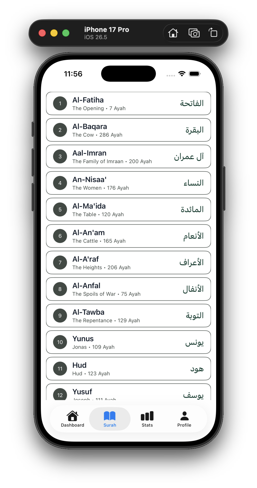
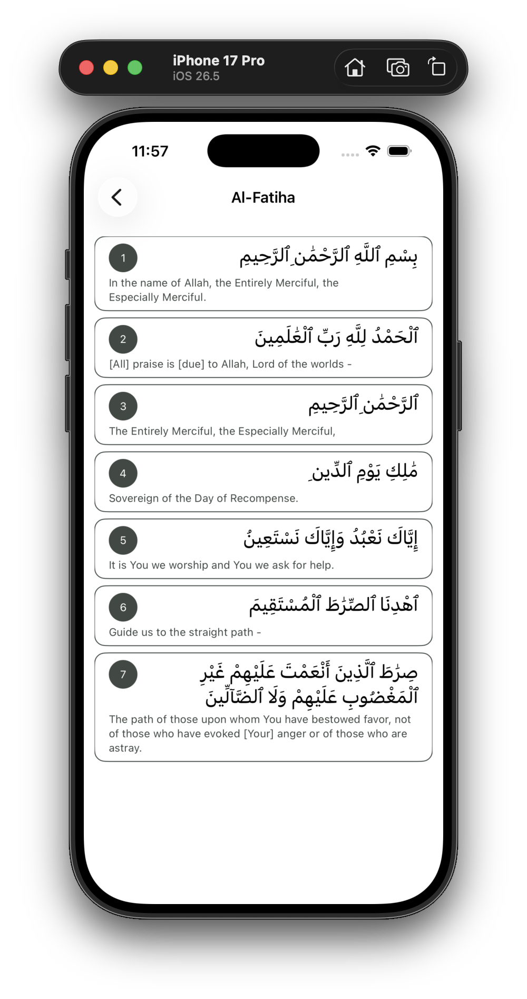

<div align="center">

# 🕌 Alquran Reminder

### _"Connect with the Creator before connecting with the world."_

A privacy-first, ad-free iOS digital-wellbeing app that turns your social media impulse into a daily Quran reading habit.

Built as **Sadaqah Jariyah** (ongoing charity) — free, no ads, no accounts.

</div>

---

## ✨ Overview

**Alquran Reminder** inserts a mindful, spiritual pause before social media use. When you attempt to open a shielded app (Instagram, TikTok, X, etc.), iOS displays a custom Shield screen inviting you to read the Quran for a short session (default 5 minutes). Upon completion, the shield is automatically lifted.

### How It Works

```
Tap social app → Shield appears → Read Quran for N min → Auto-unlock
```

The app uses Apple's official **Family Controls** and **Managed Settings** frameworks — the same technology behind apps like Opal, One Sec, and Jomo.

> 🎨 **Figma Design** — View the design file on [Figma](https://www.figma.com/design/Yc81Cgi7aMzyMGCsFaKljN/Alquran-Daily)

---

## 📸 Screenshots

<div align="center">

|               Surah List                |            Surah Detail (Ayah Reader)            |
| :-------------------------------------: | :----------------------------------------------: |
|  |  |

</div>

---

## 🚀 Features

- **OS-Level App Shielding** — Block selected social media apps using Apple's Family Controls
- **Quran Reader** — Uthmani Arabic script with English translation (Sahih International)
- **Custom Session Timer** — Choose 1–30 minutes (default 5 min), date-based timing for background safety
- **Auto-Unlock** — Shield lifts automatically when the reading session completes
- **Offline Fallback** — Cached Quran content so the reader works without a network
- **Local Notifications** — Get notified when your session completes while backgrounded
- **Privacy-First** — No analytics, no tracking, no accounts. All data stays on-device
- **Warm, Encouraging Tone** — No guilt, no shame, no dark patterns

---

## 🛠 Tech Stack

| Layer          | Technology                                                        |
| -------------- | ----------------------------------------------------------------- |
| Language       | Swift 5.9+                                                        |
| UI             | SwiftUI                                                           |
| Min Deployment | iOS 15.0 (framework floor) — targets iOS 16+                      |
| Key Frameworks | `FamilyControls`, `ManagedSettings`, `UserNotifications`          |
| Data           | SwiftData / `UserDefaults` (App Group)                            |
| Content API    | [Al-Quran Cloud](https://api.alquran.cloud) (`api.alquran.cloud`) |
| Persistence    | File / `URLCache` for offline Quran content                       |

---

## 📁 Project Structure

```
AlquranReminder/
├── AlquranReminderApp.swift       # App entry point
├── Assets.xcassets/              # App icon & accent colors
└── src/
    ├── assets/alquran/            # Bundled Quran JSON data
    ├── components/                 # Reusable SwiftUI components
    ├── constants/AppColor.swift   # Color palette
    ├── models/                     # Data models (Surah, Ayah, Item)
    ├── services/                   # Core services (Shield, Auth, Content)
    ├── stores/                     # State stores
    ├── utils/                      # QuranHelper, QuranParser
    └── views/
        ├── ContentView.swift       # Main TabView
        ├── DashboardView.swift     # Home dashboard
        ├── SurahView.swift          # Surah list
        ├── SurahAyahView.swift      # Ayah reader
        ├── StatsView.swift          # Reading stats
        └── ProfileView.swift        # Settings & profile
```

---

## 🔧 Build & Run

### Prerequisites

- **Xcode** (latest version)
- **Physical iPhone** with iOS 16+ (Simulator does not support Family Controls)
- **Family Controls Entitlement** — requested via the [Apple Developer Portal](https://developer.apple.com)

### Steps

1. Clone the repository:
   ```bash
   git clone <repo-url>
   cd AlquranReminder
   ```
2. Open the project in Xcode:
   ```bash
   open AlquranReminder.xcodeproj
   ```
3. Select your physical iPhone as the run target.
4. Configure signing with your Apple Developer account (Family Controls capability required).
5. Build and run (`⌘R`).

> ⚠️ **Note:** If the Family Controls entitlement is not yet approved, shield features will fail at runtime. The app guards these calls and shows an explanatory fallback.

---

## 🏗 Architecture

The project follows an **MVVM-lite** architecture:

- **Views** stay dumb — pure SwiftUI declarative UI
- **View Models** hold logic and state
- **Core services** own side effects, wrapped behind protocols for testability:
  - `AuthorizationProviding` — wraps `AuthorizationCenter`
  - `ShieldManaging` — wraps `ManagedSettingsStore`
  - `QuranContentProviding` — wraps the API + cache
  - `SessionClock` — wraps Date-based timing

Services are dependency-injected into view models. Views never call system frameworks directly.

---

## 🔒 Privacy

- All settings and reading data stay **on-device**
- No network calls other than the Quran content API
- No third-party SDKs that collect data
- App Privacy label: **"Data Not Collected"**

---

## 📖 Domain Rules — Islamic Content

- Uses the **Uthmani script** edition (`quran-uthmani`) for Arabic
- Renders Arabic **RTL** with proper diacritics
- Default English translation: `en.sahih` (Sahih International)
- Copy tone is **warm, encouraging, and respectful** — never judgmental
- Ayah boundaries are kept intact; no truncation mid-ayah

---

## 📜 License

This project is built as **Sadaqah Jariyah** (ongoing charity). It is free and open.

---

## 🤝 Contributing

Contributions are welcome! Please read the `AGENTS.md` file for detailed coding conventions, architecture guidelines, and domain rules before making changes.

---

<div align="center">

_Barakallahu feek_ 🤲

</div>
